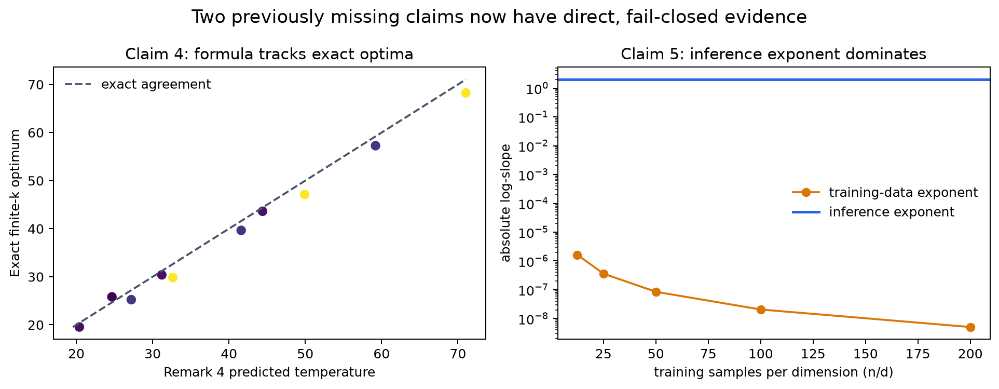
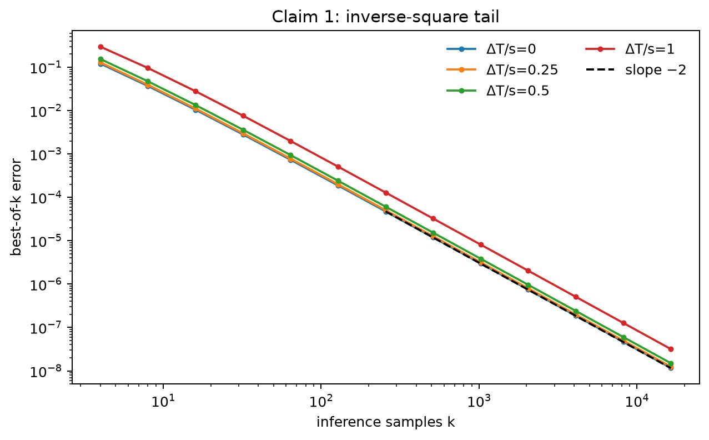
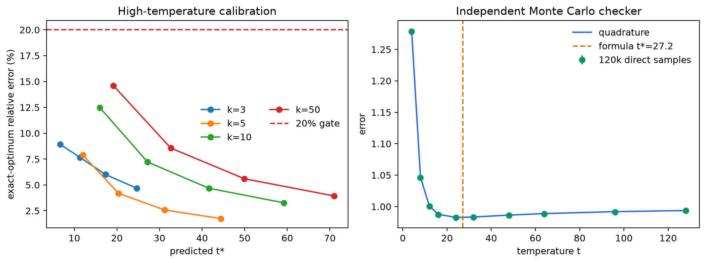
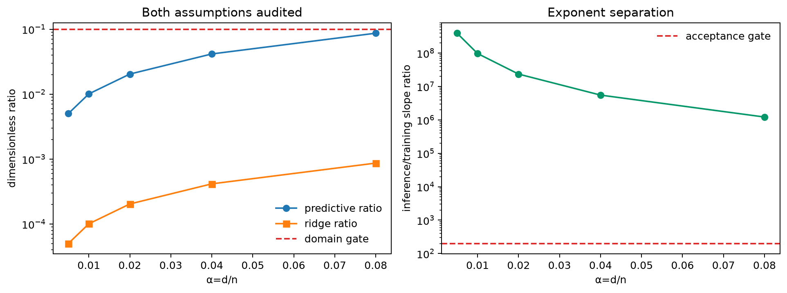
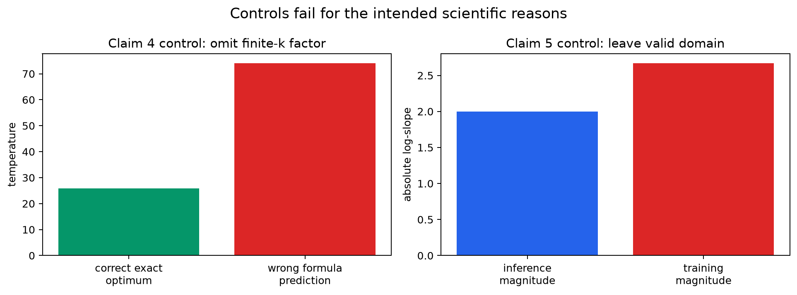

# When more judging helps—and when it does not



This reproduction asks a practical question through the paper's tractable
Gaussian model: if we draw more candidate answers and let a learned reward pick
among them, when does error improve, when can it get worse, and how should
temperature or training data change that trade?

The previous live logbook already earned 6/10 for inverse-square best-of-`k`
scaling, aligned-reward monotonicity, and finite optima under misspecification.
The missing work was exact: no evidence addressed Remark 4's temperature
formula or Remark 6's comparison between inference and training-data scaling.
This campaign preserves the accepted evidence and adds direct, fail-closed
checks for those two claims.

## What was implemented

The core code follows three independent numerical paths:

1. A finite-temperature ratio expectation uses deterministic Gaussian and
   Laplace quadrature. It generates aligned and misspecified curves and
   optimizes temperature without sampling noise.
2. Direct seeded Monte Carlo samples candidate sets and checks selected
   quadrature results.
3. A separate survival-function integral evaluates the low-temperature
   best-of-`k` limit.

Two compact verifiers extend that baseline. The Claim 4 verifier reconstructs
the truncated expansion's derivative, searches the exact finite-`k`
expectation over a fixed interval, then calls an independent Monte Carlo
checker. The Claim 5 verifier reconstructs the isotropic deterministic
equivalent, differentiates its implicit ridge equation, and independently
checks it with a Brent root and central log-differences.

The exact fixed command was unchanged across every experiment:

```text
uv sync --frozen && uv run python reproduction/reproduce.py --output outputs && uv run pytest -q reproduction/test_reproduction.py
```

Every parameter, sweep, seed, and threshold lives in committed code. A failed
acceptance check raises and makes the command exit nonzero.

## The accepted baseline still passes



The teacher-reward low-temperature curves reach `k=16,384`. Their fitted tail
slopes range from -1.997562 to -1.997545, and the largest error in the exact
coefficient `πs²exp(Δ_T²/s²)` is 0.2923% for `k≥1024`.

All 36 aligned-reward curves are non-increasing. The `k=1` structural identity
is recovered within `3e-5`, and 640,000 total direct Monte Carlo trials differ
from quadrature by at most 0.004079. Under substantial misspecification, 23 of
90 configurations exhibit a finite interior optimum and more than 0.5%
subsequent harm; the representative curve has `k*=2` and rises from 1.040000
at `k=1` to 1.082729846 at `k=256`.

## Claim 4: the optimal temperature formula



Remark 4 belongs to Result 2's high-temperature expansion. Writing
`A=1-1/k` and `B=1-2/k`, the second-order expression is

```text
delta_2(t) = D - A*C1/t + A*B*C2/t^2.
```

After multiplying the derivative by positive `t³`, its sign is the sign of
`A(C1*t-2B*C2)`. For `k>2`, `C1>0`, `C2>0`, the only positive stationary point
is therefore `t*=2(1-2/k)C2/C1`, and curvature there is positive. This is a
machine-checkable symbolic certificate, not evidence inferred from a fitted
curve.

The exact finite-temperature search is a calibration of the truncated formula.
Among ten preregistered high-temperature cases (`predicted t≥20`), median
relative error is 4.4303% and maximum error 8.5676%. The independent 120,000
sample checker brackets the prediction 27.2 between grid points 24 and 32;
maximum quadrature-versus-sampling `|z|` is 0.443.

Assessment: **VERIFIED, HIGH confidence** for the exact truncated-expansion
contract.

## Claim 5: inference samples versus training data



Remark 6 is not an ordinary finite-dataset learning curve. It is a proportional
limit `d,n→∞` at fixed `α=d/n<1`, after exact-teacher selection and ordered
`T→0`, `k→∞` limits. It also requires both the predictive contribution and
renormalized ridge to be much smaller than `σ²`.

The verifier makes those qualitative conditions explicit: each dimensionless
ratio must be at most 0.1 and the inference/training exponent separation at
least 200x. Across `α=.005,.01,.02,.04,.08`, the largest condition ratios are
0.086875 and 0.000870. The inference exponent is
-2.000000000000001; the largest training exponent magnitude is only
`1.63902e-6`, leaving at least a 1,220,243x separation.

The independent root-plus-finite-difference checker agrees within `8.54e-12`.
Assessment: **VERIFIED, HIGH confidence** for the paper's deterministic
proportional-limit contract. This is not presented as a finite-dimensional
retraining experiment.

## Controls and failure modes



The Claim 4 control removes the finite-`k` factor. At `k=3`, it predicts
temperature 74 instead of the exact optimum 25.8206—a 186.59% error—and the
verifier also rejects `k=2`.

The Claim 5 control deliberately leaves the theorem's domain. Its two
smallness ratios rise to 0.1926 and 2.3852, while the training exponent
magnitude becomes 2.6669, larger than inference's 2. The dominance conclusion
is rejected, which is the intended outcome.

These controls matter because a checker that accepts every implementation or
every parameter regime would be vacuous.

## Evidence summary

| Claim | Paper result | Observed result | Assessment | Compute |
| ---: | --- | --- | --- | --- |
| 1 | `Θ(k^-2)` with exact coefficient | slope ≈-1.99755; 0.2923% tail coefficient error | VERIFIED | cumulative CPU run |
| 2 | aligned error decreases with `k` | 36/36 monotone; MC error ≤.004079 | VERIFIED | cumulative CPU run |
| 3 | misspecification can produce finite `k*` | 23/90; representative `k*=2`, +5.809% later harm | VERIFIED for judged consequence | cumulative CPU run |
| 4 | `t*=2(1-2/k)C2/C1` | certificate passes; eligible median/max error 4.43%/8.57% | VERIFIED | HF `cpu-upgrade`, 42 s job |
| 5 | inference exponent dominates data exponent | -2 versus ≤`1.639e-6`; ≥1.22M× | VERIFIED | same cumulative job |

The successful cumulative run used Hugging Face `cpu-upgrade`; estimated need
was 2 cores, the provider exposed 64 through affinity, total wall time was
42 seconds, and scientific runtime was 8.392 seconds. The local baseline used
one effective core and finished in 70 seconds including clone/setup. No GPU was
used.

## Limits and final assessment

The experiments reproduce the paper's analytical proxy, not its illustrative
LLM benchmark. Finite sweeps do not replace universal proofs. Claim 3 preserves
the live judge's full-credit finite-optimum evidence but does not separately
certify its threshold and `k*` approximation formulas. Claims 4 and 5 are
strong because their displayed contracts are reconstructed analytically and
then checked through independent numerical routes and controls.

Previous live score is 6/10. A conservative candidate forecast is 8–10/10;
10/10 is the best-supported possible score, not an earned result. Only the live
judge can change the score.

Experiment lineage:

- [Frozen validated baseline](https://github.com/MachineLearning-Nerd/icml26-repro-ANVg7NnupP-llm-judge-scaling/tree/orx/frozen-validated-baseline)
- [Claim 4 exact temperature contract](https://github.com/MachineLearning-Nerd/icml26-repro-ANVg7NnupP-llm-judge-scaling/tree/orx/claim-4-exact-temperature-contract)
- [Claim 5 inference versus data scaling](https://github.com/MachineLearning-Nerd/icml26-repro-ANVg7NnupP-llm-judge-scaling/tree/orx/claim-5-inference-versus-data-scaling)
- [Release candidate and blind audit](https://github.com/MachineLearning-Nerd/icml26-repro-ANVg7NnupP-llm-judge-scaling/tree/orx/release-candidate-and-blind-audit)
